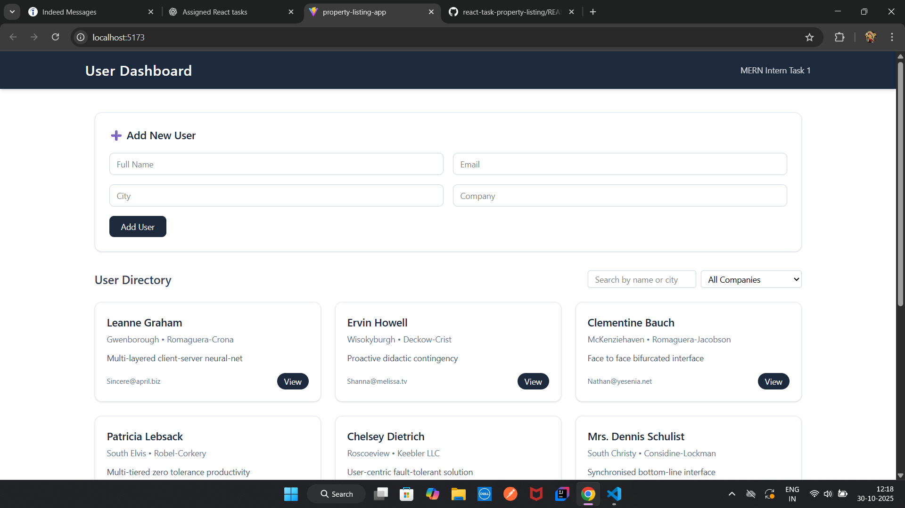
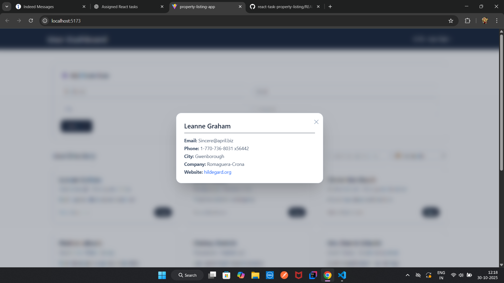
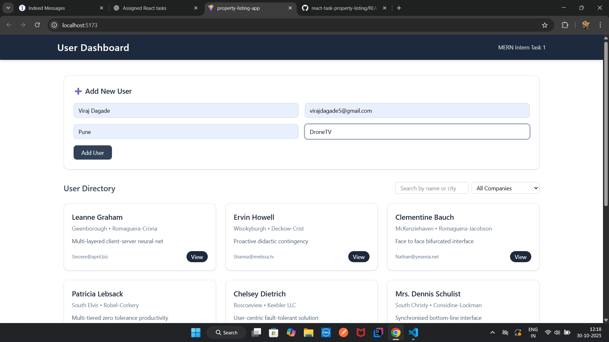
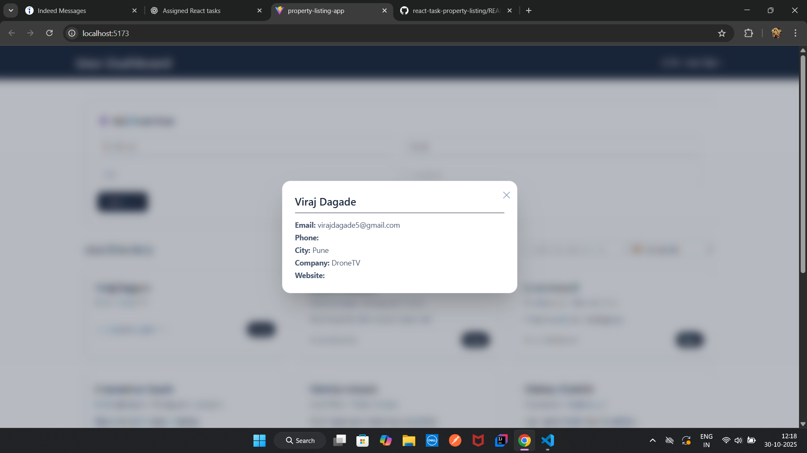
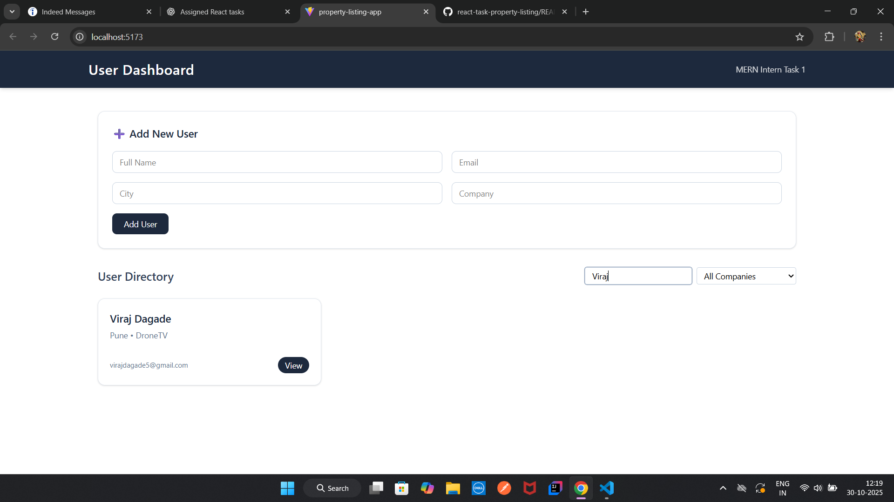

# 🏠 React User Directory App

This project was created as part of **React Task 1 Assignment**.

## 🔧 Tech Stack

- React + Vite
- Tailwind CSS
- JSONPlaceholder API
- react-hot-toast (for notifications)

## ✨ Features

- Fetch and display user data
- View detailed user info in modal
- Add new user with instant UI update
- Search and filter users by company
- Responsive, modern UI with Tailwind

## 🚀 Setup

```bash
npm install
npm run dev
```

## 📸 Preview






